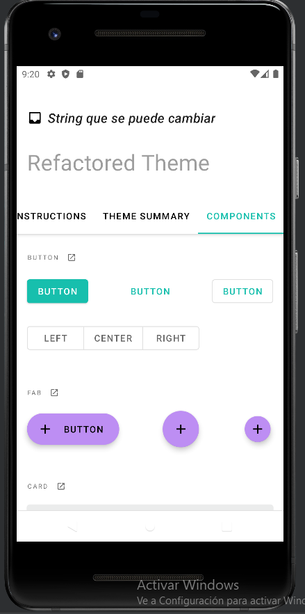
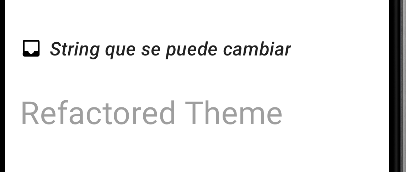

## Modificacion de Strings y cambio de owner
  * Primero cogi el proyecto y le cambie algunos strings para hacer un commit inicial
  * Despues le cambie el propietario del repositorio borrando el .git y lo subi a mi github 
  *  Texto del activity_main [values/strings.xml](https://github.com/ArinoMichi/MaterialPractica/blob/master/app/src/main/res/values/strings.xml)
    
  
  
## Creacion de la rama Colors y modificacion
  * Para cambiar algunos colores hice una rama especifica en la que modifique los colores del tema claro y del oscuro e hice commit
  * Colores [values/colors.xml](https://github.com/ArinoMichi/MaterialPractica/blob/master/app/src/main/res/values/color.xml)
  
  * 

## Merge
  * Finalmente hice un merge para actualizar los colores de la rama master
